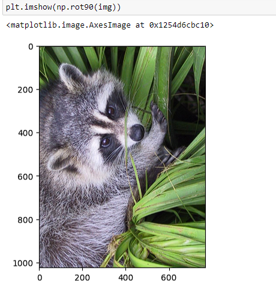

# Advanced python projects

En este repositorio encontraras una serie de proyectos que estoy realizando como parte de mi bootcamp en python, podrás ver como se llego a los resultados
y ver el paso a paso ingresando a la carpeta correspondiente al proyecto en cuestión y seleccionando el archivo ".ipynb" contenido en cada uno de los proyectos.

----

## Day 75 - Plotly charts

En este proyecto se exploran datos acerca de las aplicaciones mas relevantes de la playstore, se hace la limpieza de datos
y se construyen diferentes grafos en base a los sets de datos generados acorde a el resultado esperado en cada caso.

Visualise Categorical Data: Content Ratings

Category Concentration - Downloads vs. Competition

Colour Scales in Plotly Charts - Competition in Genres

Grouped Bar Charts: Free vs. Paid Apps per Category

Plotly Box Plots: Lost Downloads for Paid Apps

Entre otros gráficos

----

##  Day 76 - Computation with NumPy and N-Dimensional Arrays

En este proyecto se abordan algunos ejemplos para comprender la importancia de 'Numpy', tales como las operaciones matematicas en la matrices,
así mismo se hacen algunos ejemplos de como podemos manipular imagenes convetiendolas a matrices usando numpy.

Broadcasting and Scalars

Convert the image to black and white

Rotate the colour image

Invert (i.e., solarize) the colour image

----

## Day 77 - Linear Regression and Data Visualisation with Seaborn

En este proyecto se utiliza seaborn basada en mayplotlib para hacer la representación grafica de un sets de datos correspondiente a peliculas, su 
presupuesto y sus ganancia, se abordan temas como la limpieza de datos, la preparación de datos y la regresion lineal.

Plotting Movie Releases over Time

Seaborn Regression Plots

Uso de la regresion lineal para estimar el ingreso por presupusto de pelicula

----

##  Day 78 - Advanced - Analysing the Nobel Prize with Plotly, Matplotlib & Seaborn